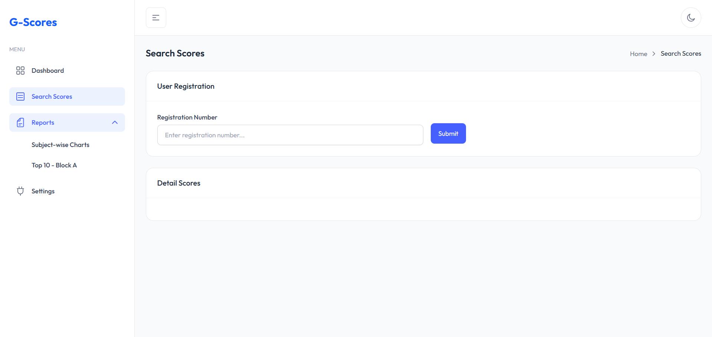
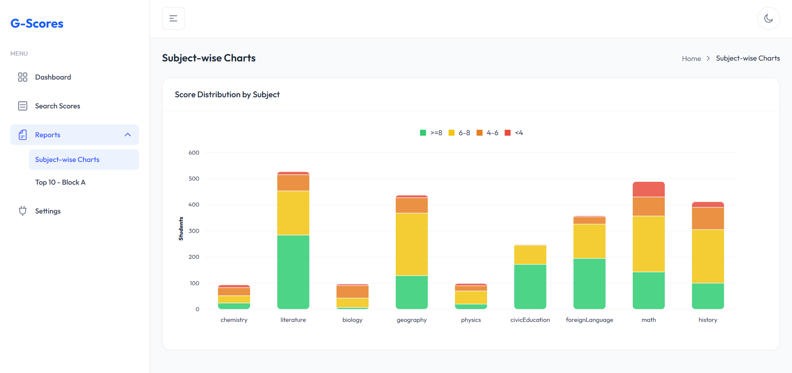
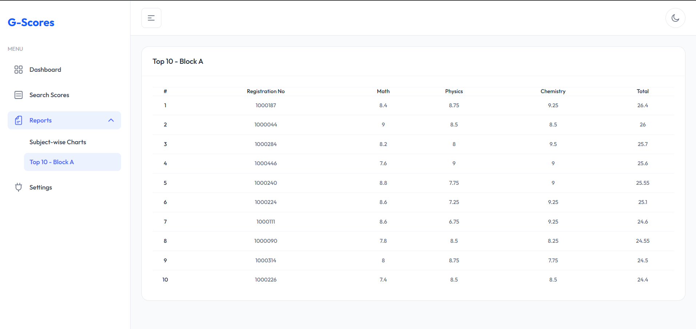

# G-Scores

This is my submission for the Golden Owl Web Developer Intern Assignment. The project is built as a full-stack web application to manage and analyze high school exam scores for the year 2024.

## 🚀 Features

### ✅ Must Have
- ✅ Parse raw data (`diem_thi_thpt_2024.csv`) and store into database using **Flyway Migration** & **Seeder**.
- ✅ Search student scores by **Registration Number**.

  
  
- ✅ Generate reports with score bands:
  - `>= 8 points`
  - `6 - 8 points`
  - `4 - 6 points`
  - `< 4 points`

  
  
- ✅ Top 10 students for Block A (Math, Physics, Chemistry).

  
  
### ✨ Nice to Have
- ✅ Fully responsive design for desktop, tablet & mobile.
- ✅ Fullstack project containerized with **Docker Compose**.
- ✅ Fully deployable production-ready architecture.

---

## 🛠 Technology Stack

### Frontend
- **React** + **TypeScript** + **Vite**
- Tailwind CSS (UI optimized)
- ApexCharts for chart visualization
- Axios for API consumption

### Backend
- **Spring Boot 3 (Java 21)**
- Spring Data JPA (Hibernate)
- Flyway for database migration
- HikariCP connection pool
- Maven for build automation

### Database
- **MySQL 8**

### Deployment
- Docker & Docker Compose (Multi-stage builds for optimal image size)
- Ready to deploy on platforms like **Render / Railway **

---

## 🖥 Application Overview

### Data Flow
1. Raw CSV file processed via seeder logic.
2. Data stored into MySQL using Flyway migration.
3. Backend exposes secured RESTful APIs.
4. React frontend consumes APIs and presents clean data visualizations.

### Main Functionalities

| Feature | Description |
|---------|-------------|
| Search Score | Input registration number to lookup student's exam result |
| Score Reports | Generate score band distributions per subject |
| Top 10 Block A | List top scoring students in Math - Physics - Chemistry |
| Full Chart | Interactive stacked bar charts with dynamic scaling |
| Responsive UI | Adaptive across devices |

---

## 🧪 How to Run Locally

### 1️⃣ Prerequisites

- Install [Docker](https://docs.docker.com/get-docker/)
- Install [Git](https://git-scm.com/)
- Java 21
- Install Node.js (for frontend local)
- Install Java 21 (for backend local)
- Install MySQL 8+ (for backend local)
- IntelliJ IDEA

### 2️⃣ Clone Project

```bash
git clone https://github.com/GoldenOwlAsia/webdev-intern-assignment-3.git
```

### 3️⃣ Option 1 — Run with Docker 🐳

```bash
cd G-Scores
```
```bash
docker compose up --build
```
- MySQL will run on port 3366
- Backend (Spring Boot) will run on http://localhost:8080
- Frontend (React) will run on http://localhost:3000

⚠️ **Note:** During the initial Docker startup, the backend will run database seeders to import a large dataset. This process might take some time. It's recommended to let it run for a few minutes and then restart the containers to speed up subsequent runs.

### 4️⃣ Option 2 — Run Locally

- If you run backend directly on your local machine or IntelliJ
``` bash
CREATE DATABASE thpt_scores CHARACTER SET utf8mb4 COLLATE utf8mb4_unicode_ci;
```
- Import student.sql file directly if you want to import data faster without running Flyway or seeders:
- Open the /backend folder in IntelliJ IDEA. Next, Run the BackendApplication.java main class
- Open the /frontend folder in IntelliJ IDEA
``` bash
npm install
npm run dev
```
### 5️⃣ Option 3 — Access Deployed Web 🌐

The project is deployed and available online: [LinkWeb](https://g-scores-web.netlify.app/)

## 🏷 Author

- Your Name: Nguyen Huu Vinh 
